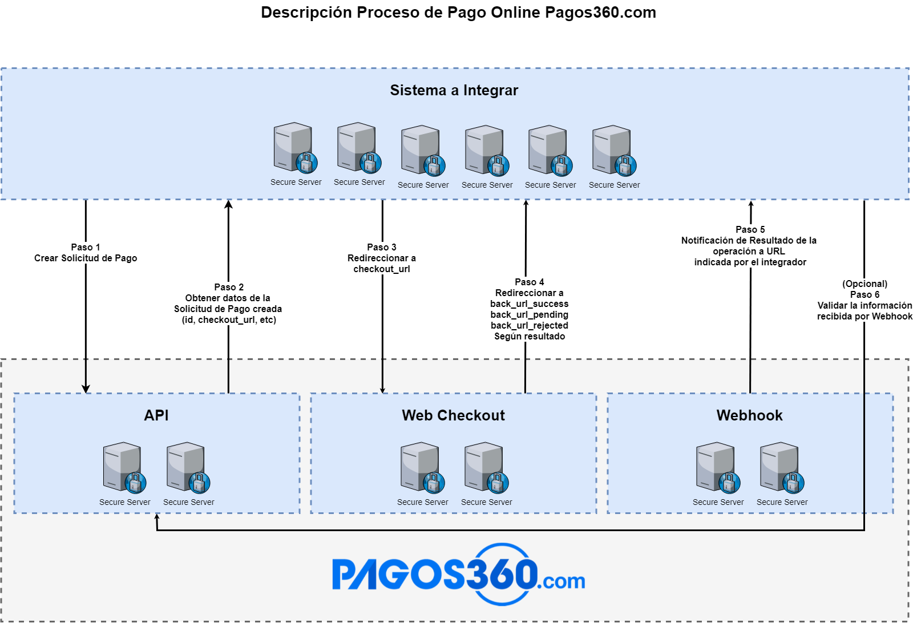

<a name="inicio"></a>
# sdk-.net
SDK para realizar transacciones por medio de Pagos360.com 

Modulo para conexión con Pagos360.com

  + [Introducción](#introduccion)
	+ [Alcance](#alcance)
  + [Instalación](#instalacion)
	+ [Descripci&oacute;n de Libreria](#descripcion)
    + [Versiones de .Net soportadas](#versionesdenetsoportadas)
	+ [Documentacion para Integraci&oacute;n](#apiparadesarrolladores)
   
<a name="introduccion"></a>

## Introducción
A continuaci&oacute;n se detalla el flujo de una transacci&oacute;n a trav&eacute;s de Pagos360.com

</br>

<a name="alcance"></a>

### Alcance
La **sdk .Net** provee soporte para su **aplicaci&oacute;n**, encargandose de la comunicaci&oacute;n con la **API de Pagos360.com**.

<a name="instalacion"></a>
## Instalación
Se debe descargar las clases contenidas en la carpeta Pagos360ApiClientLibrary con el bot&oacute;n Clone or Download del branch master.
Una vez descargadas las clases, se debe crear un proyecto de tipo libreria de clases vacio con Visual Studio y agregar las carpetas Model, Properties, Resources, Services.
Por ultimo importe este proyecto como libreria de clases .dll dentro de la estructura de su Sistema.

```C#
using Pagos360ApiClientLibrary.Model;
using Pagos360ApiClientLibrary.Properties;
using Pagos360ApiClientLibrary.Resources;
using Pagos360ApiClientLibrary.Services;
```

<a name="descripcion"></a>
### Descripci&oacute;n de Libreria
- Model: Contiene la estructuras de entidades necesarias para mapear las Request y las Response de la API de Pagos360.com.
- Properties: Informaci&oacute;n de la versi&oacute;n del SDK .net.
- Resources: Contiene las funciones para interactuar con la API de Pagos360.com.
- Services: Clase generica para ejecutar GET, POST, PUT y DELET de una API REST.

<a name="versionesdenetsoportadas"></a>
### Versiones de .Net soportadas
La versi&oacute;n implementada de la SDK, esta testeada para versiones desde .net 3.5

<a name="apiparadesarrolladores"></a>
### Documentacion para Integraci&oacute;n

Se encuentra disponible la documentaci&oacute;n para integradores en [API para desarrolladores](https://ayuda.pagos360.com/v2/reference).

[<sub>Volver a inicio</sub>](#inicio)
